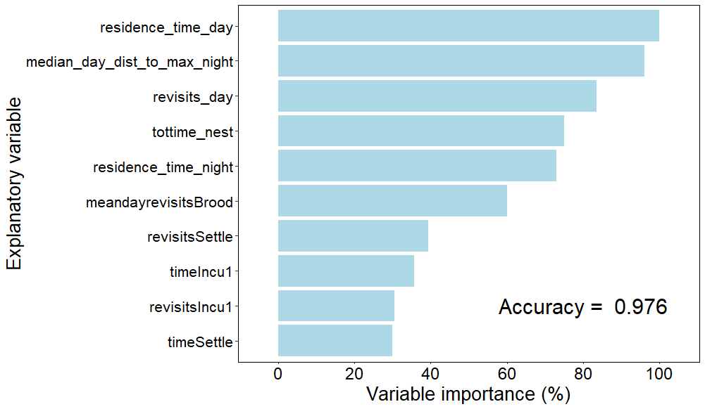
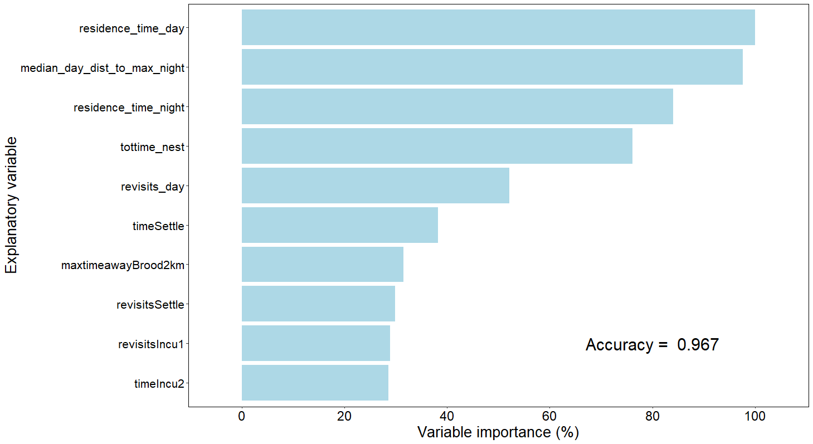
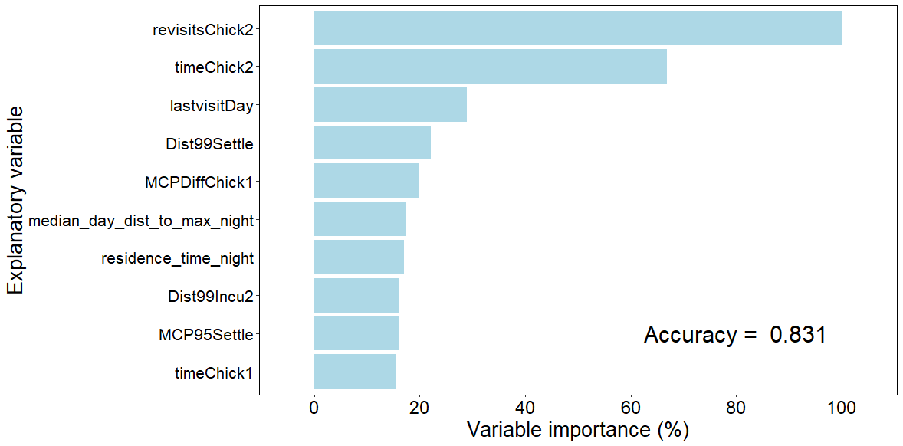

# NestTool
This R package is an informal collection of R functions created by the [Swiss Ornithological Institute](https://www.vogelwarte.ch) to extract demographic information from the tracking data of birds. The functions were developed in the framework of a Red Kite project, and tested and validated mainly for Red Kites. The functions read in tracking data, extract movement and nest visitation metrics, and emply RandomForest models to predict whether individuals had a territory, a nest, and bred successfully in a given season based on the tracking data.


## Installation


This package is not available on CRAN and must therefore be installed from [GitHub](https://github.com/Vogelwarte/NestTool) with the following command. . Note that depending on the R version and operating system you are working on, you may need to specify the download options. See [here](https://cran.r-project.org/web/packages/remotes/readme/README.html) for options for other operating systems (only Windows OS option shown in code below):


```r
library(remotes)
options(download.file.method="wininet")  ### for Windows OS 
remotes::install_github("Vogelwarte/NestTool", dependencies=TRUE)
library(NestTool)
```


# How to use NestTool

Below we show how tracking data collected from long-lived birds during the breeding season can be used in a `NestTool` workflow to understand whether individuals bred in a given year, and whether they bred successfully. It is important to note that the specific workflow you use (i.e. which functions and in what order) will depend on the species of interest and the associated data at hand - if you have no data to train a model (e.g. tracking data with ground observations confirming the existence and outcome of actual nests of the tracked birds), then you will not need to run the functions that build these models. However, you will rely on the transferability of the models trained with Red Kite data in Switzerland to predict the nesting behaviour and success of your population.


## Preparing the data

First, you will need to prepare the tracking data. This step is not included in a function, but you will likely have your own workflows for data preparation depending on where and how your data are stored. Two input files are needed: (1) a data.frame with tracking data and information on individual season and id as a unique identifier (`year_id`). This data.frame must contain a `timestamp` field, and coordinates in both geographic (`lat_wgs`, `long_wgs`) and projected coordinate systems (`lat_eea`, `long_eea`). (2) a data.frame with life history information per individual and season, which links to the tracking data.frame by the unique identifier (`year_id`).This data.frame must contain columns for the age (`age_cy` as integer in calender years) and sex (`sex`: either 'm' or 'f') of individuals in that season. Optional - if known, this data.frame can contain columns `HR` (with two levels, 'yes' or 'no') to indicate whether a bird displayed territorial behaviour, `nest` (with two levels, 'nest' or 'no nest') and `success` (with two levels, 'yes' or 'no') to indicate whether the individual in that season bred and raised fledglings or not.

This is how you could read in your data:


```r
### LOAD THE TRACKING DATA AND INDIVIDUAL SEASON SUMMARIES 
trackingdata <- fread("MyTrackingData.csv")
indseasondata <- fread("MyTrackingMetaData.csv") %>%
  mutate(nest = case_when(nest_id > 0 ~ "nest",
                        nest_id == 0 ~ "no nest"))

# if you do not have age and sex information stored in a separate file, but with the tracking data, you can easily create the indseasondata:
#indseasondata <- trackingdata %>% group_by(year_id) %>%
#  summarise(sex=first(sex), age_cy=first(age))
```

Once your data have been loaded, we use the first `NestTool` function to extract the movement metrics for each individual and season. This is the most complicated function that requires a lot of thoughtful input, because the movement metrics will be calculated based on the various input values. The four parameters (`latboundary`, `longboundary`, `startseason`, `endseason`) will crop the data to the spatial and temporal domain of interest, and remove tracking data from outside the breeding season and region of interest. The parameter `minlocs` is designed to eliminate individuals that simply do not have sufficient data points during the defined season to extract movement metrics at sufficient temporal resolution (the number of locations needs to be adjusted for the length of the season, but we generally recommend that >5 locations per day are necessary).

There are 6 further parameters that specify certain phases of the breeding season, during which the movement behaviour of breeding birds can be expected to change. The brood phase of small chicks (`broodstart`, `broodend`) will be used to calculate the longest time outside the `homeradius` as it is unlikely that successfully breeding birds would leave their chicks alone for a long time during this period. The four parameters (`settleEnd`, `Incu1End`,`Incu2End`,`Chick1End`) are demarcation points to allow for 5 different phases of the breeding cycle over which home range size, distances from the nest and times around the nest will be calculated. Although the parameters are named by settlement, incubation and chick rearing, the demarcation points set here by the user need not reflect these natural transitions but can be arbitrary time points at which the user expects that movement behaviour might naturally change. The first phase is from `startseason` to `settleEnd` and the last phase is from `Chick1End` to `endseason`. It is important to keep in mind that the absolute value of the movement metrics is irrelevant - the difference between birds that are nesting (successfully) and those that are *not* nesting (or *not* successfully) is important for the tool to work accurately.

The next set of parameters concern the radius around locations over which recursions and residence times are calculated to identify a plausible nest location. `nestradius` is the radius in m around all locations that will be used to quantify times spent within that radius and how often a bird returned to that radius. The location with the greatest time spent within `nestradius` will be selected as the potential nest site. The `homeradius` is the distance in m which indicates the basic home range of the species, and is only used to calculate the time that birds spent outside that radius during the brood phase, when successfully breeding birds would be very unlikely to spend much time outside the `homeradius`.

`age` is a parameter in calendar years that will be ignored if either the tracking data or the `indseasondata` already contain a column (`age_cy`) that specifies the age in calendar years. If no data are submitted then the value entered here will be used. Note that because the prediction of nesting behaviour and success from movement depends on the age of the bird, filling in missing data with a generic value will lead to lower accuracy in predictions.


```r
#### this takes approximately 15 minutes for ~500 individuals
#### note that inputs to time parameters are the respective day of the year, but you can get this from the function lubridate::yday as we demonstrate for the brood phase
nest_data_input <- data_prep(trackingdata = trackingdata,
                      indseasondata = indseasondata,
                      latboundary = 45,
                      longboundary = 4,
                      startseason = 70,
                      endseason = 175,
                      broodstart = lubridate::yday(lubridate::ymd("2023-05-01")),
                      broodend = lubridate::yday(lubridate::ymd("2023-06-01")),
                      settleEnd = 97, # end of the settlement period in yday
                      Incu1End = 113, # end of the first incubation phase in yday
                      Incu2End = 129, # end of the second incubation phase in yday
                      Chick1End = 152, # end of the first chick phase in yday
                      minlocs = 800,
                      nestradius = 50,
                      homeradius = 2000,
                      age = 10) # age of individuals for which no age is provided with data 

names(nest_data_input$summary)
```

The function `data_prep` returns a list with 5 different elements, a summary with one row per individual season that lists many variables such as the distances between the most frequented day and night locations, the relative MCP areas, the relative travel distances between the nest and daily locations, and the number of times the nest is revisited and for how long during the 5 different phases that were specified by the input parameters. The function also returns potential nest locations, and the formatted tracking data which will be used later on to visualise individuals that cannot be classified with high confidence automatically.

## Identifying breeding behaviours

The next steps are to identify breeding behaviours, which will be done sequentially. First, we identify whether individuals have a home range (or a 'territory'), which is typically shown by frequent returns and long residency times at a single location. We then identify whether birds exhibit nesting behaviour (which is similar to having a territory, but with even more stringent attachment to a single location), and ultimately whether the nesting attempt was actually successful (for the birds that initiated nesting).

Each of those steps is made up of two functions: one to train a model using data where the actual behaviour of the tracked birds was observed and is therefore known, and a second function to use that model to predict the behaviour for tracked birds (which can include birds for which the actual behaviour was not known). If no training data (with known behaviour) exist, the models built with data from red kites in Switzerland can be used to predict the breeding behaviour of tracked birds. Please note that if you want to extrapolate these models to different populations or species, you should adjust the breeding phenology in `data_prep` accordingly, and consider potential limitations in the predictive accuracy.

### Identifying home range / territorial behaviour

First, we use the data.frame summary created by `data_prep` to train a model for home range behaviour using the function `train_home_range_detection`, which we can then apply to predict for each individual and season whether the bird held a territory (had a home range) in that season using the function `predict_ranging`.


```r
### train a model for home range behaviour
hr_model <- train_home_range_detection(trackingsummary = nest_data_input$summary, plot = T)
#saveRDS(hr_model, "output/hr_model.rds")   ## optionally save the model for later use

### predict home range behaviour for tracked birds
## if no model has been trained, the model statement can be omitted and the Red Kite model from Switzerland will be used
hr_model<-NestTool::hr_model  ## loads the model from the package
pred_hr <- predict_ranging(model = hr_model$model, trackingsummary = nest_data_input$summary) 
```

When training a model with the function `train_home_range_detection`, a graph will be produced that indicates the most important predictor variables and the accuracy in predicting the correct outcome for testing data that were not used to train the model (these are automatically split from the input to `train_home_range_detection`). The accuracy is the proportion of cases that were predicted correctly, and ranges between 0 (all predictions were false) to 1 (all predictions were correct). Our model for red kites in Switzerland achieves an accuracy of >95% of correct home range classification, and we see that the total time spent within the nest radius during the day, and the distance between day and night roost locations are important to distinguish between territorial and vagabonding birds.


<div class="figure" style="text-align: center">

<p class="caption">Permutation-derived variable importance of predictor variables to classify whether home range behaviour occurred</p>
</div>


### Identifying nesting attempts

Next, we use the data.frame created by `predict_ranging` (or the summary from `data_prep`) to train a model for nesting behaviour using the function `train_nest_detection`. Here we need to carefully subset the data to only use individual seasons where information about a nest is available. We can then use the resulting model to predict for each individual and season whether the bird initiated a nesting attempt in that season using the function `predict_nesting`. We will do this using the data.frame created in the previous step (`pred_hr`) so that we keep the output of all models contained in this single data.frame.


```r
### train a model for nesting attempts
nest_model <- train_nest_detection(trackingsummary = nest_data_input$summary[!is.na(nest_data_input$summary$nest),], plot = T)
#saveRDS(nest_model, "nest_model.rds")   ## optionally save the model for later use

### predict nesting attempts for tracked birds
## if no model has been trained, the model statement can be omitted and the Red Kite model from Switzerland will be used
nest_model<-NestTool::nest_model  ## loads the model from the package
pred_nest <- predict_nesting(model = nest_model$model, trackingsummary = pred_hr) # note that you can predict to all data, including those without information on whether a nest existed or not
```

Similar to the home range model above, the function `train_nest_detection` will return a graph that indicates the most important predictor variables and the accuracy in predicting the correct outcome for testing data that were automatically split from the input to `train_nest_detection`. Our model for red kites in Switzerland achieves an accuracy of >95% of correct nesting classification, and we see that the total time spent within the nest radius and the distance between day and night roost locations are important to distinguish between nesting and non-nesting birds.


<div class="figure" style="text-align: center">

<p class="caption">Permutation-derived variable importance of predictor variables to classify whether a nesting attempt occurred</p>
</div>


### Identifying successful broods

Finally, we use the data.frame created by `predict_nesting` to train a model for breeding success using the function `train_nest_success`. We first filter out only those data for which success is known (either 'yes' or 'no'). We can then use the resulting model to predict for each individual and season whether they nested successfully using the function `predict_success`. This function also relies on the output of nest_prob from the function `predict_nesting`, and will automatically assign all individual seasons to 'no success' if the probability of a nesting attempt predicted by the function `predict_nesting` was below the minimum probability of the training data used to create the nest success model (based on the logic that if the probability to nest was very low, then the bird likely did not raise any chicks because it may not have nested in the first place). However, the user can manually adjust that threshold using the input parameter `nest_cutoff` in the function `predict_success`.


```r
### train a model for home range behaviour
succ_model <- train_nest_success(nestingsummary = pred_nest[pred_nest$success %in% c("yes","no"),], plot = T)
#saveRDS(succ_model, "succ_model.rds")

### predict nesting success for tracked birds
## if no model has been trained, the model statement can be omitted and the Red Kite model from Switzerland will be used
succ_model<-NestTool::succ_model  ## loads the model from the package
pred_succ <- predict_success(model = succ_model$model, nestingsummary = pred_nest, nest_cutoff = succ_model$nest_cutoff)
```

When training a model with the function `train_nest_success`, a similar graph as above will be produced that indicates the most important predictor variables and the accuracy in predicting the correct outcome for testing data. Our model for red kites in Switzerland achieves an accuracy of >75% of correct nest success classifications - which is much less accurate than the identification of home range and nesting behaviour. The number of visits to the nest during the late chick stage, and the amount of time spent around the nest are very important to determine success, but the less impressive accuracy is due to the fact that even some birds that fail to raise fledglings remain around their nest (this was one of the main reasons why the approach used in the R package [nestR](https://github.com/picardis/nestR) did not work for our purposes).


<div class="figure" style="text-align: center">

<p class="caption">Permutation-derived variable importance of predictor variables to classify whether a nesting attempt was successful</p>
</div>


## Manually classifying individuals

The above steps provide a quick classification of nesting and success for many tracked individuals, but there will be some for which the predicted probability of nesting or success will be marginal. The package `NestTool` therefore provides a graphical user interface to visually inspect an individual's movements over a season to quickly determine whether it was nesting successfully or not.

### Extracting more detailed movement metrics

To aid in the manual determination of breeding behaviours and outcomes, we first need to run the function `move_metric_extraction`, which will return distances and minimum convex polygon range sizes over the entire breeding season based on moving 5-day windows. We use the data.frames `movementtrack` and `pot_nests` created by `data_prep` and the data.frame created by `predict_success` and enter the same definitions for `seasonstart`, `seasonend` and `nestradius` as for the function `data_prep` above.

Because extracting these movement metrics for every 5 day period over the breeding season for every individual takes a long time, we can control for which individuals we want to do this by the `uncertainty` parameter. This parameter filters out all individuals whose nesting success was predicted with a lower probability than `uncertainty` and a higher probability than `1-uncertainty`, and basically leaves only those individuals for which the automated classification has been highly uncertain. By decreasing the value to 0, movement metrics will be extracted for all individuals, if `uncertainty` is set to 0.5 then no individuals will be selected (because the probability cannot exceed 0.5 for a binary classification).


```r
move_metrics <- move_metric_extraction(trackingdata = nest_data_input$movementtrack,
                                       nest_locs = nest_data_input$pot_nests,
                                       inddata = pred_succ,
                                       uncertainty = 0.25,
                                       nestradius = 50,
                                       startseason = 70,
                                       endseason = 175)
plot_move_metrics(movemetrics = move_metrics, individual = "2022_95")
```


The utility function `plot_move_metrics` will show a graph of 5 movement metrics for a single individual, with the `year_id`, `sex`, and `age` in the title of the plot.


<div class="figure" style="text-align: center">

<p class="caption">Seasonal trajectory of movement metrics of a focal individual to assist with manual classification</p>
</div>


### Annotating nesting outcomes

The final function is `movement_visualisation` which will open a Shiny App that allows the user to visually inspect the tracks and movement metric graphs for each of the individual seasons that fall below the thresholds of uncertainty. We use the data.frames `movementtrack` and `pot_nests` created by `data_prep`, the data.frame created by `predict_success` and the data.frame created by `move_metric_extraction`. Furthermore, `uncertainty` must be specified so that only those individuals are considered for which the automated classification has been highly uncertain. This value must be the same as for `uncertainty` in `move_metric_extraction` (or higher) to ensure that the movement metrics for the selected individuals for have actually been extracted (otherwise they cannot be displayed). Finally, a path must be defined where a data.frame containing the decisions entered by the user will be saved as a csv file.


```r
movement_visualisation(trackingdata = nest_data_input$movementtrack,
                       nest_locs = nest_data_input$pot_nests,
                       inddata = pred_succ,
                       move_metrics = move_metrics,
                       uncertainty = 0.25,
                       output_path="NestTool_example_nest_success_output.csv")
```


The Shiny App opened by the function `movement_visualisation` consists of four panels:

- In the panel at the top left, a unique identifier can be selected to analyse an individual season. The data can be displayed for the entire breeding period or for individual months. In addition, the data can be displayed in a way that daytime locations, night-time locations and twilight locations are visualised differently.

- In the top right panel, the movement data are displayed on an interactive map. The locations are colour-coded by date and, if required, the movement trajectory can also be displayed. The potential nest location (as determined by the function`data_prep`) is also shown on the map. In addition to the topographic map, a satellite image can be selected as a background map in order to better identify forest areas or individual potential nest trees. The measurement tool allows distances and areas to be measured.A black bird icon can be moved dynamically by either pressing the 'Play' button in the bottom left corner or by using the manual time slider in the bottom-right corner. This dynamic animation helps to visualise the movements of the bird over time. Note that the date format in the box above the time slider is MM/DD/YYYY (American format).

- The panel at the bottom right implements the function `plot_move_metrics` and shows a graph of 5 movement metrics for the selected individual and season. The temporal variation of the 5 movement metrics during the breeding period facilitates the decision on nesting and breeding success.

- The panel at the bottom left shows a table that displays a row for every individual season containing the most important move metrics, as well as the decisions that were entered by the user.

With the help of the different movement visualisations, a decision can be made in the panel at the top left for each individual season whether nesting took place and whether the brood was successful. After pressing the "Save" button, the decisions are displayed in the table in the panel at the bottom left and simultaneously saved as a data.frame under the specified path. The decisions can be overwritten at any time if necessary. After closing the Shiny App, the output table should be saved in a different location or renamed to avoid overwriting it and losing the decisions already made when starting the Shiny App again.


<div class="figure" style="text-align: center">

<p class="caption">Example of the Shiny App to assist with manual classification of individual seasons</p>
</div>


## Summarising demographic parameters

The main goal of `NestTool`is to provide information about demographic parameters. Using the output of the functions above, we can now quickly summarise the breeding propensity and success of our population of interest.

First, we need to combine the birds that were classified automatically and those for which we annoztated the outcomes manually. The latter will have been saved in a user-specified csv table, which we will read in and merge with the remaining predictions.


```r
## READ IN AND COMBINE DATA OF MANUALLY CLASSIFIED AND AUTOMATICALLY CLASSIFIED DATA
MANUAL<-fread("NestTool_example_nest_success_output.csv") %>%
  rename(ManNest=Nest,ManSuccess=Success) %>%
  select(year_id,ManNest,ManSuccess)
ALL<-pred_succ %>% select(year_id,hr_prob,nest_prob,succ_prob) %>%
  left_join(MANUAL, by='year_id') %>%
  mutate(nest_prob=ifelse((!is.na(ManNest) & ManNest=="Yes"),1,nest_prob), succ_prob=ifelse((!is.na(ManSuccess) & ManSuccess=="Yes"),1,succ_prob)) %>%
  mutate(nest_prob=ifelse((!is.na(ManNest) & ManNest=="No"),0,nest_prob), succ_prob=ifelse((!is.na(ManSuccess) & ManSuccess=="No"),0,succ_prob)) %>%
  mutate(HR=ifelse(hr_prob>0.5,1,0),Nest=ifelse(nest_prob>0.5,1,0),Success=ifelse(succ_prob>0.5,1,0))
```

We can then easily extract the breeding propensity (defined as the proportion of birds with a home range or territory that actually had a nesting attempt) and the breeding success (defined as the proportion of birds that initiated a nesting attempt and raised at least one fledgling).


```r
## breeding propensity - what proportion of birds with a homerange have a nesting attempt?
ALL %>% filter(HR==1) %>% ungroup() %>%
  summarise(Propensity=mean(Nest))

## breeding success - what proportion of birds with a nesting attempt are successful?
ALL %>% filter(Nest==1) %>% ungroup() %>%
  summarise(Success=mean(Success))
```

For our Swiss Red Kite data, the breeding propensity predicted from tracking data was 0.822 (compared to 0.813 observed propensity), whereas the breeding success was 0.654 (compared to 0.595 observed success). Overall, this is a reasonably similar outcome and we therefore hope that the package `NestTool` will allow others to extract valuable demographic information from tracking data.


***

### Reference
If you use any functions in this package for your work, please use the following citation:

Beeli, U. (2023): Determining the Breeding Success of Red Kites (*Milvus milvus*) using GPS Telemetry. Master's Thesis,Department of Geography, University of Zurich, Switzerland.

Also consider an alternative package [nestR](https://github.com/picardis/nestR), which we originally tried for this work but found less accurate than our approach.

Picardi S, Smith BJ, Boone ME, Frederick PC, Cecere JG, Rubolini D, Serra L, Pirrello S, Borkhataria RR, Basille M. 2020. Analysis of movement recursions to detect reproductive events and estimate their fate in central place foragers. Movement Ecology 8:24.

### Example data
[MovebankID 1356790386](https://www.movebank.org/cms/webapp?gwt_fragment=page=studies,path=study1356790386): GPS and sensor data of a population of juvenile and adult red kites (*Milvus milvus*) equipped with Milsar GPS-GSM-UHF transmitters in Western Switzerland.

[MovebankID 230545451](https://www.movebank.org/cms/webapp?gwt_fragment=page=studies,path=study230545451): GSM transmitted GPS position data of red kites (*Milvus milvus*) of the red kite project of the Swiss Ornithological Institute

### Acknowledgements
This project has received funding from the European Union’s LIFE Programme and the Swiss National Science Foundation.
